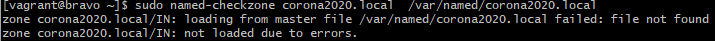
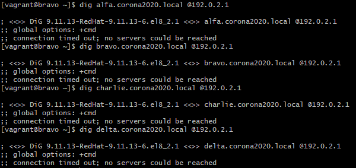
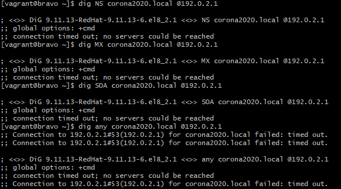
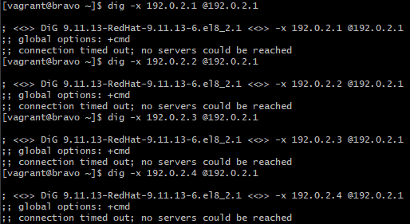
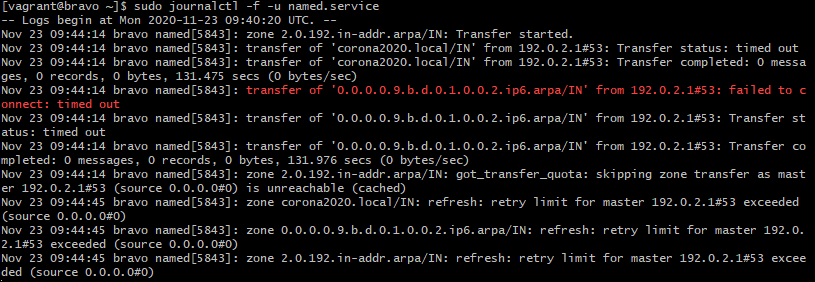
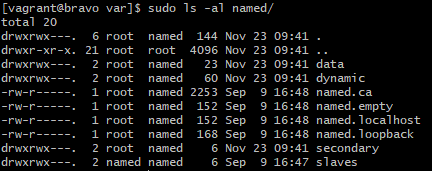

# DNS Test Rapport
## Validate config files:
- Main config file is syntactically correct
- Cannot find the file /var/named/corona2020.local

- service named is running
- Bij de dig-commando's kreeg ik onderstaande error:

- Na deze commando's besloten om de test te beeindigen omdat telkens dezelfde error terug komt. Hieronder voeg ik nog enkele commando's uit die misschien helpen bij het troubleshooten:

