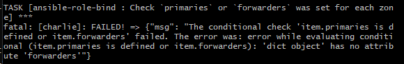

# TestRapport Webserver
- De machine probeerde op te starten met een rol die niet aanwezig is.
- Hoogst waarschijnlijk wegens geen 'wordpress' rol die aanwezig zou moeten zijn.
  - Geprobeerd met deze rol. Vroeg om rol httpd -> rol httpd toegevoegd.
  - Error op de afwezigheid van httpd_packages variabele.
- Ik heb volgende rollen geprobeerd:
  - ansible-role-rh-base
  - ansible-role-postgresql
  - ansible-role-bind
- Hierbij kreeg ik een error

- Hierna ook eens geprobeer met volgende rollen:
  - ansible-role-rh-base
  - ansible-role-postgresql
- Hierbij kreeg ik geen error, maar kan ik de website niet bereiken (ERR_CONNECTION_TIMED_OUT)
