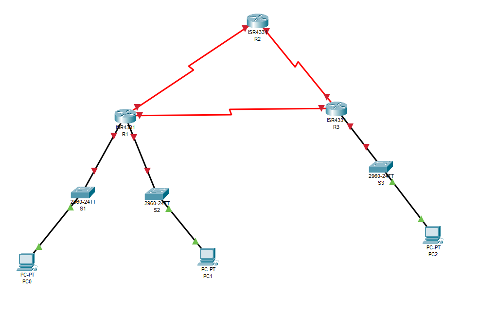
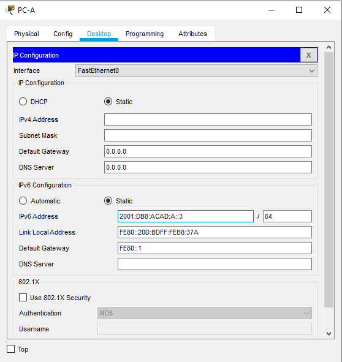
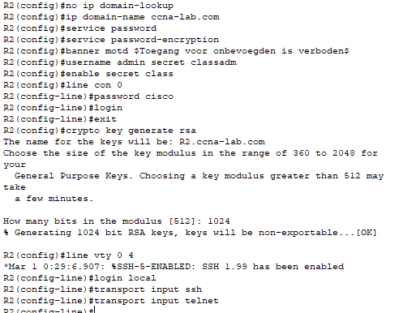

# Testrapport
## Testplan

- Vanwege beperkingen van packet tracer is het moeilijk om het 2e deel van het labo te testen. Daarom testen we enkel dat de connectiviteit (ping) nog steeds in orde is.
- Je test twee maal het pingen naar de PC's en routers. Een keer nadat de standaard configuratie op de routers en switches in orde is en OSPF opgezet is.
- De tweede keer wordt er getest nadat de ACL's opgezet zijn.

# Connections

3 routers, 3 switches, 3 pc's

- Router 1
  - S0/1/0 -> Router 2: S0/1/0
  - S0/1/1 -> Router 3: S0/1/0
  - G0/1 -> Switch 1: G0/1
  - G0/0 -> Switch 2: G0/1
- Router 2
  - S0/1/1 -> Router 3: S0/1/1
  - Overbodig (om te controleren):
    - S0/1/0 -> Router 1: S0/1/0
- Router 3:
  - G0/1 -> Switch 3 G0/1
  - Overbodig (om te controleren):
    - S0/1/0 -> Router 1: S0/1/1
    - S0/1/1 -> Router 2: S0/1/1

In packet tracer voeg je seriele poorten toe door het toestel uit te schakelen en dan de foto van NIM-2T erin te plaatsen (Onderaan rechts) en het toestel opnieuw aan te zetten.

## Opmerking
Ik heb voor de seriele poorten van de routers andere interfaces gebruikt dan die dat in het testplan staan. Deze heb ik ook aangepast hierboven.

## Screenshot

# Configure PC's
## PC-A:
- Ip: 2001:DB8:ACAD:A::3/64
- Default Gateway: FE80::1

## PC-B:
- Ip: 2001:DB8:ACAD:B::3/64
- Default Gateway: FE80::1

## PC-C:
- Ip: 2001:DB8:ACAD:C::3/64
- Default Gateway: FE80::3

## Screenshots
- PC-A

- PC-B

- PC-C

# Configure switches

## Switch 1:
- no ip domain-lookup
- hostname S1
- ip domain-name ccna-lab.com
- service password-encryption
- banner motd #Toegang voor onbevoegden is verboden#
- username admin secret classadm
- enable secret class
- line con 0
  - password cisco
  - login
  - logging synchronous
- crypto key generate rsa
  - 1024
- line vty 0 15
  - login local
  - transport input ssh
  - transport input telnet

## Switch 2:
- no ip domain-lookup
- hostname S2
- ip domain-name ccna-lab.com
- service password-encryption
- banner motd #Toegang voor onbevoegden is verboden#
- username admin secret classadm
- enable secret class
- line con 0
  - password cisco
  - login
  - logging synchronous
- crypto key generate rsa
  - 1024
- line vty 0 15
  - login local
  - transport input ssh
  - transport input telnet

## Switch 3:
- no ip domain-lookup
- hostname S3
- ip domain-name ccna-lab.com
- service password-encryption
- banner motd #Toegang voor onbevoegden is verboden#
- username admin secret classadm
- enable secret class
- line con 0
  - password cisco
  - login
  - logging synchronous
- crypto key generate rsa
  - 1024
- line vty 0 15
  - login local
  - transport input ssh
  - transport input telnet

## Screenshots
  - Switch 1
  
  
  

  - Switch 2

  
  

  - Switch 3
  
  
  

# Routers

## Router 1:
- no ip domain-lookup
- hostname R1
- ip domain-name ccna-lab.com
- service password-encryption
- banner motd #Toegang voor onbevoegden is verboden#
- username admin secret classadm
- enable secret class
- line con 0
 - password cisco
 - login
- crypto key generate rsa
 - 1024
- line vty 0 4
 - login local
 - transport input ssh
- ipv6 unicast-routing
- interface S0/1/0
  - ipv6 address 2001:DB8:AAAA:1::1/64
  - ipv6 address FE80::1 link-local
  - no shutdown
- herhaal voor onderstaande interfaces
  | R1 (FE80::1) | | link-local | area |
  |---|---|---|
  |		S0/1/0(DCE) |		2001:DB8:AAAA:1::1/64 | FE80::1 | 0 |
  |	S0/1/1 |		2001:DB8:AAAA:3::1/64 | FE80::1 | 0 |
  |	G0/0/0 |		2001:DB8:ACAD:B::1/64 | FE80::1| 0 |
  |	G0/0/1 |		2001:DB8:ACAD:A::1/64  | FE80::1| 0 |
- interface s0/0/0
  - clock rate 128000
- ipv6 router ospf 1
  - router-id 1.1.1.1
  - passive-interface G0/0/0
  - passive-interface G0/0/1
  - passive-interface G0/0/2
- in each interface:
  - ipv6 ospf 1 area 0

## Router 2:
- no ip domain-lookup
- hostname R2
- ip domain-name ccna-lab.com
- service password-encryption
- banner motd #Toegang voor onbevoegden is verboden#
- username admin secret classadm
- enable secret class
- line con 0
 - password cisco
 - login
- crypto key generate rsa
 - 1024
- line vty 0 4
 - login local
 - transport input ssh
 - transport input telnet
- ipv6 unicast-routing
- interface S0/1/0
  - ipv6 address 2001:DB8:AAAA:1::2/64
  - ipv6 address FE80::2 link-local
  - no shutdown
- herhaal voor onderstaande interfaces
  | R2 (FE80::2) | | Link-local | Area |
  |---|---|---|---|
  |		S0/1/0 |		2001:DB8:AAAA:1::2/64  |		FE80::2 | 0 |
  |		S0/1/1(DCE)	 |	2001:DB8:AAAA:2::2/64  |		FE80::2  | 0 |
  |	Lo1	 |	2001:DB8:AAAA:4::1/64	 |	N/A  | 0 |
- interface S0/1/1
  - clock rate 128000
- ipv6 route ::/0 Lo1
- ipv6 router ospf 1
  - router-id 2.2.2.2
  - default-information originate
- in each interface:
  - ipv6 ospf 1 area 0

## Router 3:
- no ip domain-lookup
- hostname R3
- ip domain-name ccna-lab.com
- service password-encryption
- banner motd #Toegang voor onbevoegden is verboden#
- username admin secret classadm
- enable secret class
- line con 0
 - password cisco
 - login
- crypto key generate rsa
 - 1024
- line vty 0 4
 - login local
 - transport input ssh
 - transport input telnet
- ipv6 unicast-routing
- interface S0/1/0
  - ipv6 address 2001:DB8:AAAA:3::2/64
  - ipv6 address FE80::3 link-local
  - no shutdown
- herhaal voor onderstaande interfaces
| R3 (FE80::3) | | link-local | area |
|---|---|---|---|
|	S0/1/0(DCE)	 |	2001:DB8:AAAA:3::2/64	| FE80::3 |	0 |
|	S0/1/1 |		2001:DB8:AAAA:2::1/64  | FE80::3 |		0 |
|		G0/0/1	 |	2001:DB8:CAFE:C::1/64  | FE80::3 |		0 |
- interface S0/1/0
  - clock rate 128000
- ipv6 router ospf 1
  - router-id 3.3.3.3
  - passive-interface G0/0/1
- in each interface:
  - ipv6 ospf 1 area 0

> Hierna test je voor de eerste keer

## Screenshots
- R1

- R2

- R3

- Final result na de eerte initiele configuraties

# TESTING 1
## PC-A:

- ping 2001:DB8:ACAD:A::3 (Default Gateway) => lukt
- ping 2001:DB8:ACAD:B::3 (PC-B) => lukt
- ping 2001:DB8:ACAD:C::3 (PC-C) => lukt
- ping 2001:DB8:AAAA:1::2 (R2) => lukt

## PC-B:

- ping 2001:DB8:ACAD:B::3 (Default Gateway) => lukt
- ping 2001:DB8:ACAD:A::3 (PC-A) => lukt
- ping 2001:DB8:ACAD:C::3 (PC-C) => lukt
- ping 2001:DB8:AAAA:1::2 (R2) => lukt

## PC-C:

- ping 2001:DB8:ACAD:C::3 (Default Gateway) => lukt
- ping 2001:DB8:ACAD:B::3 (PC-B) => lukt
- ping 2001:DB8:ACAD:A::3 (PC-A) => lukt
- ping 2001:DB8:AAAA:1::2 (R2) => lukt

## Testen is geslaagd!

# Router 1 na eerste test
- ipv6 access-list RESTRICT-VTY
  - permit tcp 2001:DB8:ACAD:A::/64 any eq telnet
  - permit tcp any any eq 22
  {Implicit deny all}
- line vty 0 4
  - ipv6 access-class RESTRICT-VTY in

- show line 0 4
- ipv6 access-list RESTRICTED-LAN
  - deny tcp any 2001:DB8:ACAD:A::/64 eq telnet
  - permit ipv6 any any
- interface g0/1
  - ipv6 traffic-filter RESTRICTED-LAN out

- interface g0/1
  - no ipv6 traffic-filter RESTRICTED-LAN out
- show access-lists

- ipv6 access-list RESTRICTED-LAN
  - permit tcp 2001:db8:acad:b::/64 host 2001:db8:acad:a::a eq telnet
{Gevolg: laat telnet toe vanuit het netwerk 2001:db8:acad:b::/64 (waartoe PC-B behoort) naar S1 }
  - permit tcp any host 2001:db8:acad:a::3 eq www
- show access-list RESTRICTED-LAN

- ipv6 access-list RESTRICTED-LAN
  - no permit tcp any host 2001:DB8:ACAD:A::3 eq www
- show access-list RESTRICTED-LAN

- interface g0/1
  - ipv6 traffic-filter RESTRICTED-LAN out

## Screenshots R1

> Hierna test je nogmaals

# Testen

## PC-A:

- ping 2001:DB8:ACAD:A::3 (Default Gateway) => lukt
- ping 2001:DB8:ACAD:B::3 (PC-B) => lukt
- ping 2001:DB8:ACAD:C::3 (PC-C) => lukt
- ping 2001:DB8:AAAA:1::2 (R2) => lukt

## PC-B:

- ping 2001:DB8:ACAD:B::3 (Default Gateway) => lukt
- ping 2001:DB8:ACAD:A::3 (PC-A) => lukt
- ping 2001:DB8:ACAD:C::3 (PC-C) => lukt
- ping 2001:DB8:AAAA:1::2 (R2) => lukt

## PC-C:

- ping 2001:DB8:ACAD:C::3 (Default Gateway) => lukt
- ping 2001:DB8:ACAD:B::3 (PC-B) => lukt
- ping 2001:DB8:ACAD:A::3 (PC-A) => lukt
- ping 2001:DB8:AAAA:1::2 (R2) => lukt

## Testen is geslaagd!

