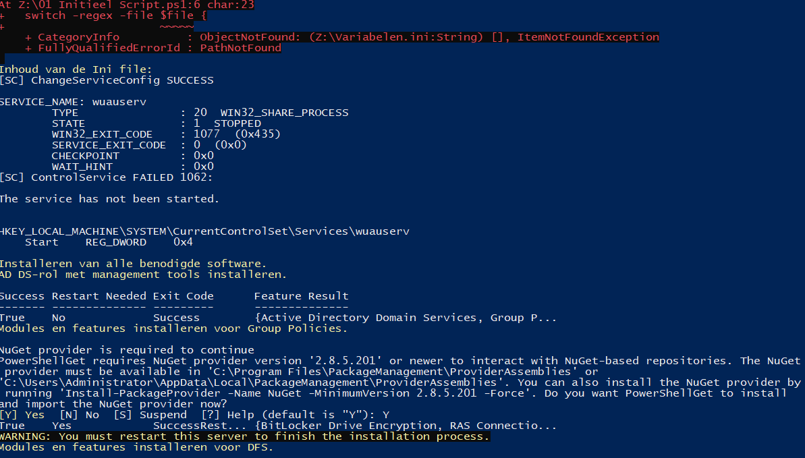
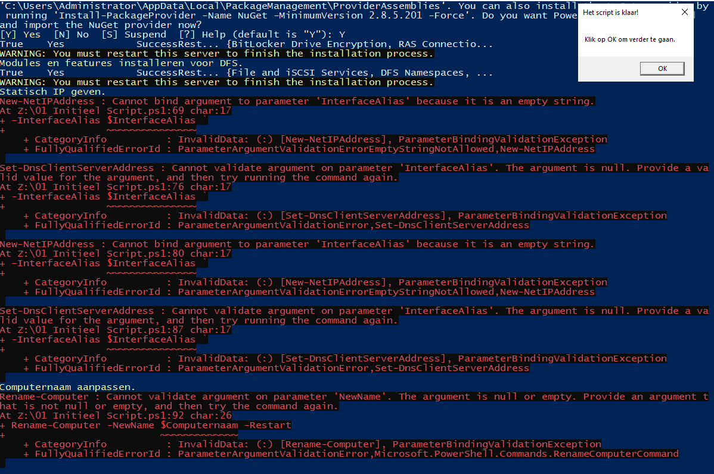
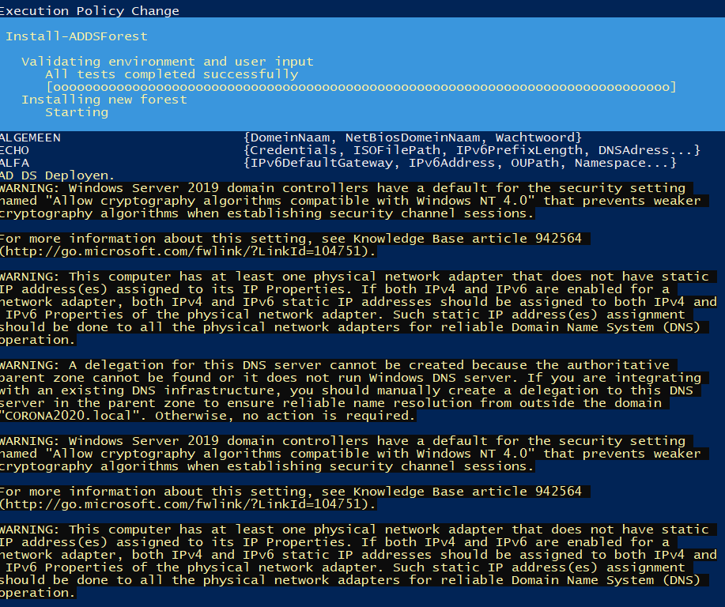
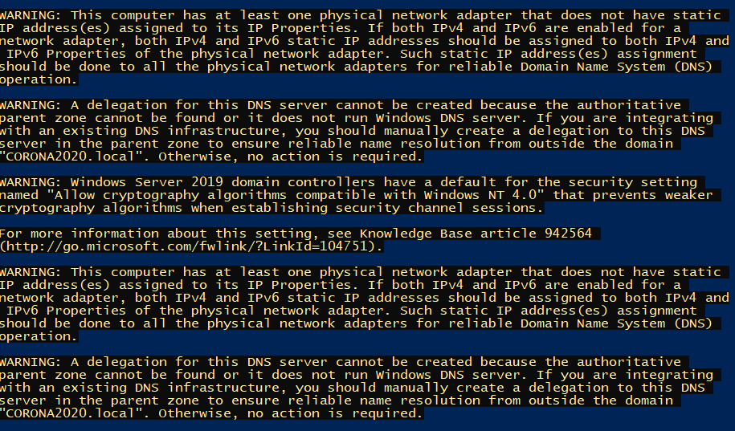
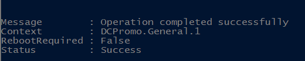
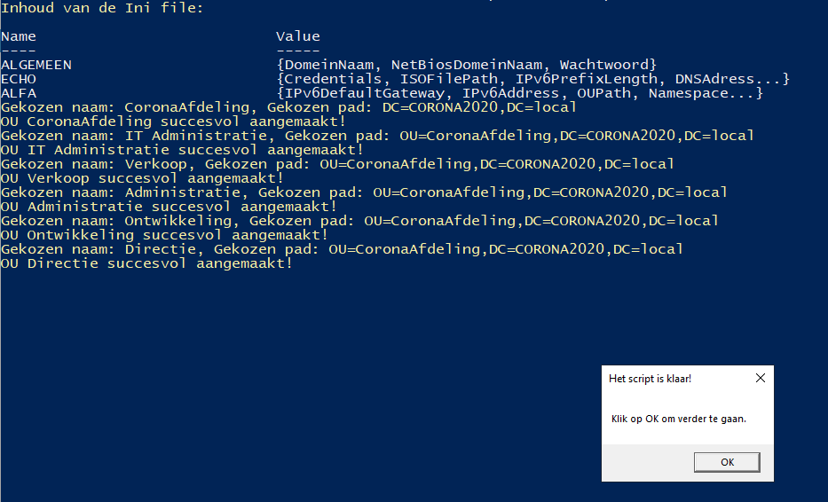
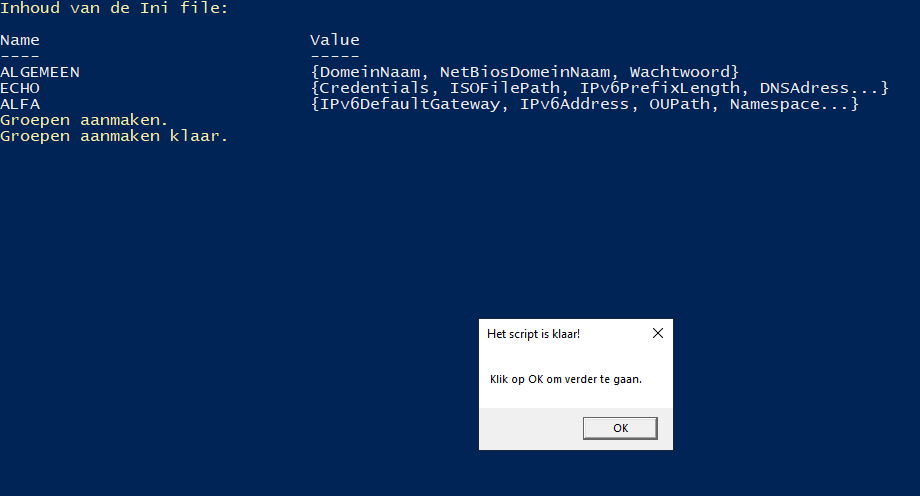
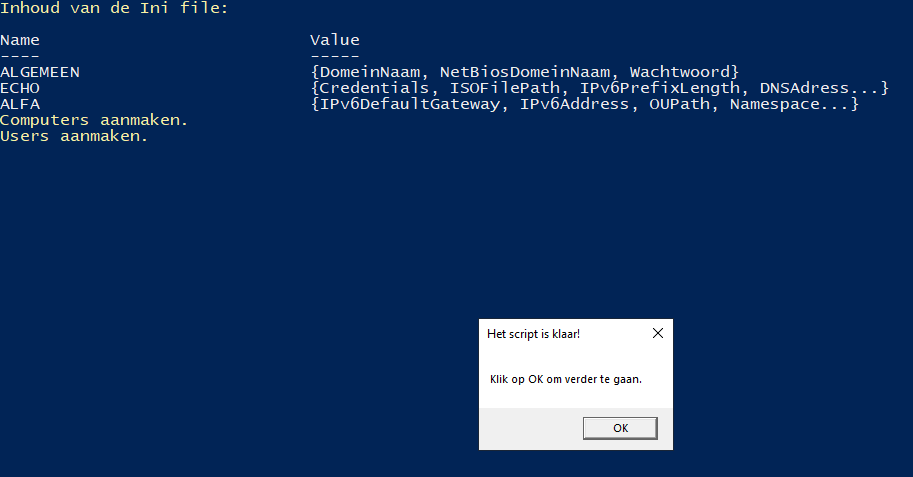

## Script 1
- Errors tijdens het uitvoeren wegens niet vinden van het ini-script.

- Om dit op te lossen heb ik in overleg (met Arne) het ini-bestand naar de map met scriptjes verplaatst.
- Hierna ben ik teruggekeerd via een snapshot naar een 'clean install' en heb ik het script zonder (visuele) problemen kunnen runnen.

### Resultaat
- Naam server: Alfa
- IPv4: 192.168.1.129, subnet: 255.255.255.248, Default Gateway: 192.168.1.128, DNS: 192.168.1.129
- IPv6: fe80:0:0:2::1, subnet: 64, Default Gateway: fe80:0:0:2::, DNS: 2001:4860:4860:0:0:0:0:8888
- Windows Update: disabled

## Script 2
- Tijdens het runnen van het script werden enkele 'warnings' gegeven.

### Resultaat
- Domein: CORONA2020.local
- Domein Services: Ok (Opmerking: Ik zie ook DNS functionaliteit, deze wordt normaal later vervangen door een andere server)

## Script 3
- Geen problemen tijdens het runnen.

### Resultaat
- Ok

## Script 4
- Geen problemen tijdens het runnen.

### Resultaat
- Ok

## Script 5
- Geen problemen tijdens het runnen.

### Resultaat
- Administratie: Pattyn Fleur, PC1-Administratie
- Directie: Hurckmans Alex, PC1-directie
- IT Administratie: Bieseman Arne, Sakkoul Lana, PC2-IT-Admin
- Ontwikkeling: Meremens Santi, PC1-Ontwikkeling
- Verkoop: Coppens Maxime, PC1-Verkoop

Waarschijnlijk Santi Meremans verkeerd gespeld?

## Script 6
- Geen problemen tijdens het runnen.
.png)
.png)
.png)
.png)

### Resultaat
- Ok. Er zijn 7 policies aanwezig.
  - 2 rond Control Panel Access
  - 2 rond Network Adapter Access
  - Default Domain Controllers policy
  - Default Domain Policy
  - No Game Link

## Script 7
- Geen problemen tijdens het runnen.
.png)
.png)
.png)
.png)
.png)
.png)
.png)
.png)
.png)

### Resultaat
- 6 directories: alexh, arneb, fleurp, lanas, maximec, santim

# Conclusie
- Ini script stond verkeerd en moet veranderd worden
- De rest komt overeen met de verwachte resultaten
