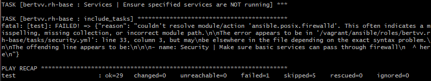

# Verslag overleg

|                     |                   |
|--------------------:|:------------------|
|            **Week** | 3                 |
|           **Datum** | 2000-10-05, 15:00 |
|        **Aanwezig** | Arne Bieseman, Maxime coppens, Alex Hurckmans, Santi Meremans, Pattyn Fleur en Lana Sakkoul|
| **Verontschuldigd** | /                 |
|         **Afwezig** | /                 |
|    **Verslaggever** |                   |

## Agenda

- Agendapunt 1
- Agendapunt 2
- Varia

## Agendapunt 1
 - role bertvv.rh-base, error met firewalld
  - gecheckt op correctheid van spaties
  - recente versies van alles
  - firewalld is niet geactiveerd op de machine
  

## Agendapunt 2

## Varia

## Actiepunten

| Wat | Wie | Deadline |
|:----|:----|:---------|
|     |     |          |
