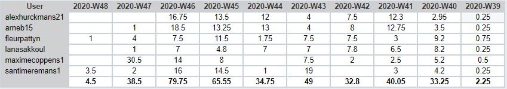

# Intervisiegesprek

|                     |                   |
|--------------------:|:------------------|
|            **Week** | 10                 |
|           **Datum** | 2020-11-23, 15:00 |
|        **Aanwezig** | Arne Bieseman, Maxime coppens, Alex Hurckmans, Santi Meremans, Pattyn Fleur en Lana Sakkoul|
| **Verontschuldigd** | / |
|         **Afwezig** | / |
|    **Verslaggever** |                   |

## Agenda

- Realisaties vorige periode
- Problemen
- Planning komende periode

## Realisaties vorige periode

### Algemeen

## Kanban-bord:

## Burndown-charts:

## Tijdsregistratie:

### Arne Bieseman

## Gerealiseerd:
- Scripts: commentaar toegevoegd en verduidelijking gegeven waar nodig

## Gepland:
- Helpen met de cloudoplossing

### Maxime coppens

## Gerealiseerd:
- GNS3 L3 switch kunnen integreren MAAR grote problemen bij VLANs opzetten
- 3 verschillende andere L3 switches online gevonden + geïntegreerd, vlan creatie ging MAAR probleem want werkte niet zoals het zou moeten
- Zeer veel informatie opgezocht ivm de L3 switch en VLANs over het algemeen in GNS3 => CONCLUSIE: L3 switching is nog niet geïntegreerd in de GNS3 software!!!
- Informatie opzoeken over GNS3 met Cloud (Azure)
- Testplan verder afgewerkt + extra document aangemaakt over de problemen die ik ben tegen gekomen

## Gepland:
- Cloud? wachten op feedback
- Testplan tot en met waar het lukt afwerken + document van informatie, tutorial en voorgekomen problemen afwerken

### Alex Hurckmans

## Gerealiseerd:
- Scripts: commentaar toegevoegd en verduidelijking gegeven waar nodig

## Gepland:
- Helpen met de cloudoplossing

### Santi Meremans

## Gerealiseerd:
Overschakeling naar drupal.
Troubleshooting met SELinux en permissies van bestanden.
Alles werkt momenteel.
Volledige focus nu op azure en ansible playbooks.

## Gepland:
Verder bestuderen azure - ansible playbooks.
Na deze fase zal ik beginnen met windows machines te bekijken op azure en hoe deze te provisionen.
### Pattyn Fleur

## Gerealiseerd:
- IPv6 in orde om te geven aan machines
- Getest DNS (Fail)
- Proberen testen Webserver (rollen fail)

## Gepland:
- Testen/Helpen GNSU3
- Testen/Helpen DNS
- Testen Webserver
- Testen DeploymentServer
- Test schrijven DHCP
- Test schrijven Mail (Indien DNS ok)

### Lana Sakkoul

## Gerealiseerd:
- Dns troubleshooting 
- Informatie opzoeken "Azure"
## Gepland:

## Problemen

## Planning komende periode
