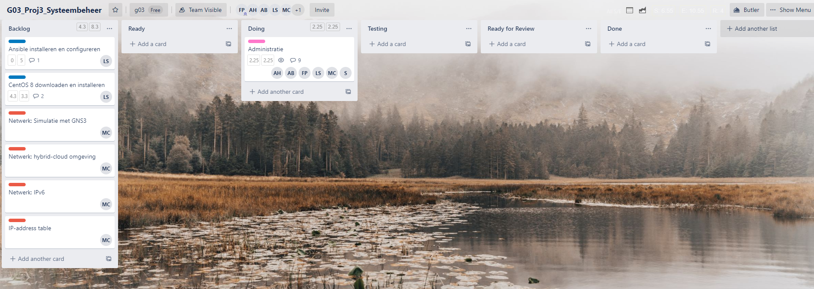
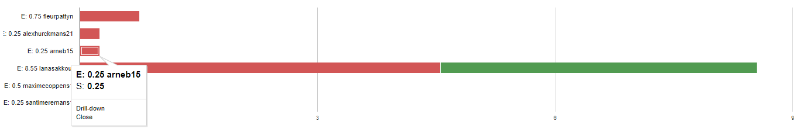
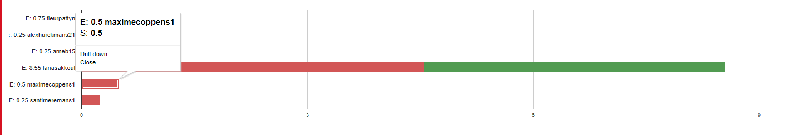
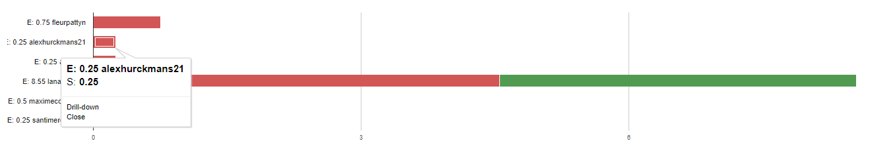
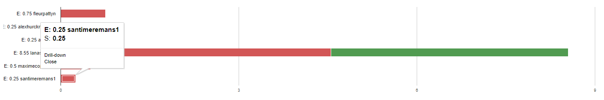
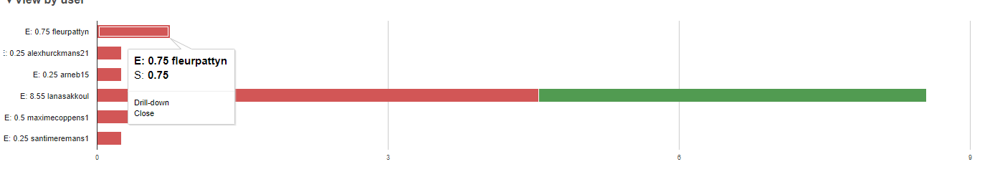
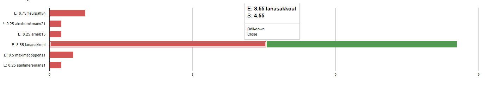
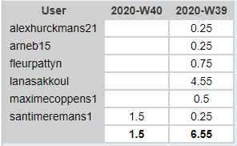

# Intervisiegesprek

|                     |                   |
|--------------------:|:------------------|
|            **Week** | 2                 |
|           **Datum** | 2020-09-28, 14:20 |
|        **Aanwezig** | Arne Bieseman, Maxime coppens, Alex Hurckmans, Santi Meremans, Pattyn Fleur en Lana Sakkoul|
| **Verontschuldigd** | / |
|         **Afwezig** | / |
|    **Verslaggever** |                   |

## Agenda

- Realisaties vorige periode
- Problemen
- Planning komende periode

## Realisaties vorige periode

- Trello opzetten
- Github opzetten
- Wegwijs maken in de opdracht
- Taakverdeling (verantwoordelijke + tester)

### Algemeen

## Kanban-bord:

## Burndown-charts:

## Tijdsregistratie:

### Arne Bieseman

## Gerealiseerd:
github gecloned.

## Gepland:
Windows server Domeincontroller uitwerken.

### Maxime coppens

## Gerealiseerd:
trello bord aanvullen met netwerk delen. Opzoeken van GNS 3.

## Gepland:
Netwerk infrastructuur schetsen met topologie + extra informatie vergaren GNS 3.

### Alex Hurckmans

## Gerealiseerd:
github gecloned.

## Gepland:
Windows server Domeincontroller helpen uitwerken, daarna sccm opzetten.

### Santi Meremans

## Gerealiseerd:
Eigen github branch aangemaakt voor webserver opdracht. Vagrant omgeving geïnitialiseerd met machine Centos 7.6 (nog aanpassen naar 8 ). Provision toegevoegd met basissoftware om nginx te kunnen installeren. Host.yml aangemaakt.

## Gepland:
Webserver verder uitwerken en proberen running te krijgen + kaartje gemaakt trello bord.

### Pattyn Fleur

## Gerealiseerd:
- Opzetten Trello
- Opzetten Github
- Informeren Vagrant

## Gepland:
- Opzetten OS
- Oefenen Vagrant
- Informerem Ansible
- Informeren emailserver

### Lana Sakkoul

## Gerealiseerd:
centOS downloaden.

## Gepland:
DNS server afwerken en Ansible start maken.

## Problemen

## Planning komende periode
- Kaarten voor de onderdelen op Trello
- Opzetten OS (Windows of Linux)
