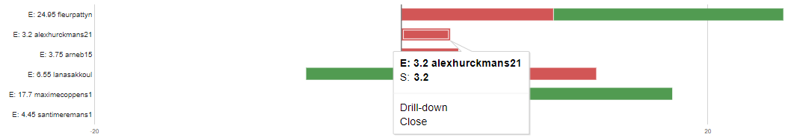

# Intervisiegesprek

|                     |                   |
|--------------------:|:------------------|
|            **Week** | 3                 |
|           **Datum** | 2020-MM-DD, HH:mm |
|        **Aanwezig** | Arne Bieseman, Maxime coppens, Alex Hurckmans, Santi Meremans, Pattyn Fleur en Lana Sakkoul|
| **Verontschuldigd** | / |
|         **Afwezig** | / |
|    **Verslaggever** |                   |

## Agenda

- Realisaties vorige periode
- Problemen
- Planning komende periode

## Realisaties vorige periode

### Algemeen

## Kanban-bord:

## Burndown-charts:

## Tijdsregistratie:

### Arne Bieseman

## Gerealiseerd:
  procedure geschreven om de vm voor de domeincontroller aan te maken.
## Gepland:

### Maxime coppens

## Gerealiseerd:
  gns3 geïnstalleerd en een eerste versie van de topologie gemaakt.
## Gepland:
  eerste configuratie gns3 en handleiding maken. Adresseringstabel maken in IPV4
### Alex Hurckmans

## Gerealiseerd:
  weekrapport gemaakt.
## Gepland:
  helpen waar nodig.
### Santi Meremans

## Gerealiseerd:
  anisble-role skeleton gecloned vagrant omgeving verder geïnitialiseerd.
## Gepland:
  basisconfiguratie instellen nginx. Proberen nginx in te stellen via ansible.
### Pattyn Fleur

## Gerealiseerd:
  - Ansible informeren
  - Basis role email zonder errors
  - Labo Netwerken packet tracer R1, S1 + Documentatie tem stap 7
## Gepland:
  - Afwerken tem stap 7 (nog enkele vraagtekens)
  - Labo Netwerken verder werken
  - Email role proberen testen lokaal
  - Fixen error firewalld
### Lana Sakkoul

## Gerealiseerd:
  -Vagrantfile to centos 8.2 aangepast
  -Basis role DNS
## Gepland:
  -DNS server aanmaken
  -BIND installeren

