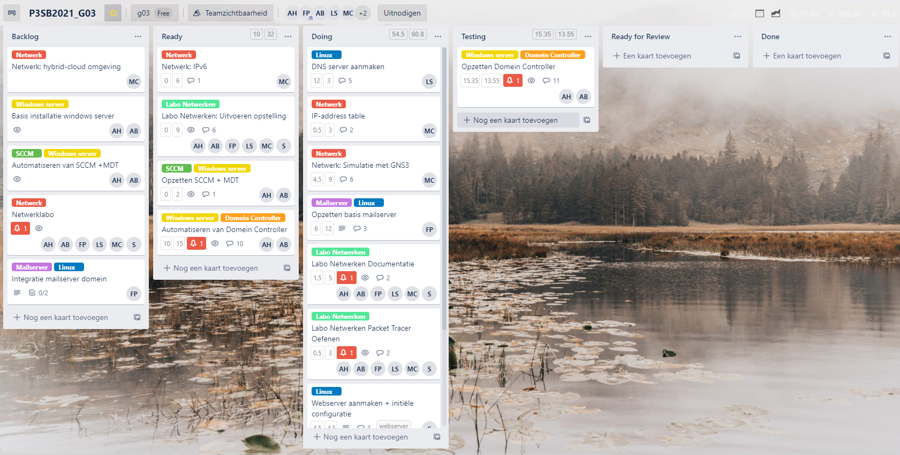
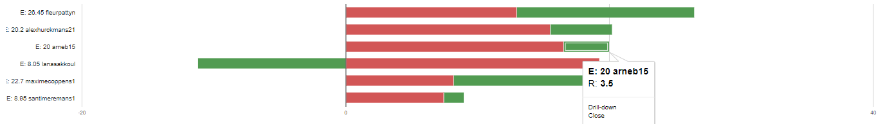
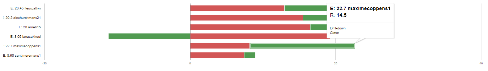
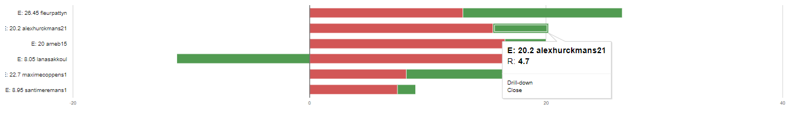
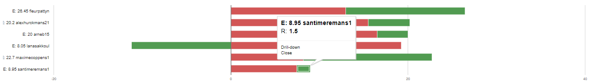
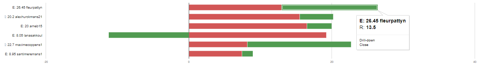
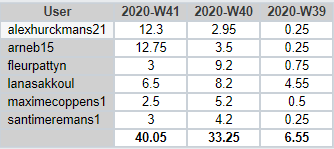

# Intervisiegesprek

|                     |                   |
|--------------------:|:------------------|
|            **Week** | 4                 |
|           **Datum** | 2020-10-12, 15:00 |
|        **Aanwezig** | Arne Bieseman, Maxime coppens, Alex Hurckmans, Santi Meremans, Pattyn Fleur en Lana Sakkoul|
| **Verontschuldigd** | / |
|         **Afwezig** | / |
|    **Verslaggever** |                   |

## Agenda

- Realisaties vorige periode
- Problemen
- Planning komende periode

## Realisaties vorige periode

### Algemeen

## Kanban-bord:

## Burndown-charts:

## Tijdsregistratie:

### Arne Bieseman

## Gerealiseerd:
- Domeincontroller opgezet (alle taken)
- Scripts gemaakt voor ADDS te installeren
- Scripts gemaakt voor OU's aan te maken
- Scripts gemaakt voor users aan te maken
- Scripts gemaakt voor DFS (nog testen en verbeteren)

## Gepland:
- De scripts voor de domeincontroller afwerken
- GUI configuratie MDT + SCCM

### Maxime coppens

## Gerealiseerd:
- GNS3 opnieuw geïnstalleerd (errors bij vorige installatie)
- GNS3 VM aangemaakt en gelinkt met applicatie
- Online documentatie opgezocht ivm gebruik van GNS

## Gepland:
- IPv4 adressentabel
- Eerste configuraties met GNS3
- Documentatie aanmaken voor gebruik GNS3

### Alex Hurckmans

## Gerealiseerd:
- Domeincontroller opgezet (alle taken)
- Scripts gemaakt voor ADDS te installeren
- Scripts gemaakt voor OU's aan te maken
- Scripts gemaakt voor users aan te maken
- Scripts gemaakt voor DFS (nog testen en verbeteren)

## Gepland:
- De scripts voor de domeincontroller afwerken
- GUI configuratie MDT + SCCM

### Santi Meremans

## Gerealiseerd:
- Gepaste webserver rol gezocht en gevonden op github
- Rol geïntegreerd in de server
- Rol aan het aanpassen om functionaliteiten te volbrengen

## Gepland:
- Rol aanpassen aan onze noden
- Troubleshooting waar nodig

### Pattyn Fleur

## Gerealiseerd:
- Mailserver error fixen (geen lijst meegeven maar een single value)
- Mailserver niet in all.yml, maar in aparte mailserver.yml

## Gepland:
- Netwerken labo afwerken
- Indien DNS er is -> Mailserver connectie proberen
- Vragen wie hulp kan gebruiken en helpen

### Lana Sakkoul

## Gerealiseerd:
- BIND geïnstalleerd
- Domein corona2020.loca aangemaakt
- IPv4, IPv6 en PTR records voor elke host aangemaakt
- CNAME, NS records aangemaakt

## Gepland:
- Troubleshooting
- Testen

## Problemen
- Aanmaken van MX records
- Reverse IPv6 lookup zone
