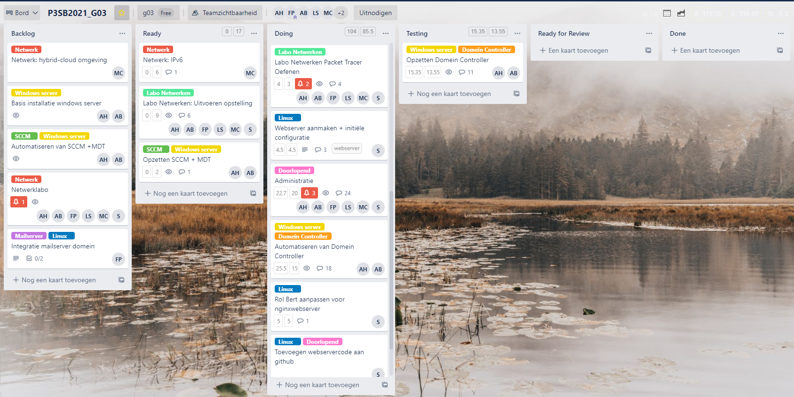
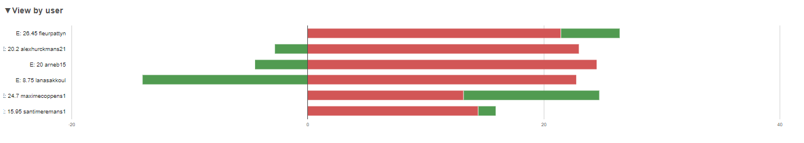
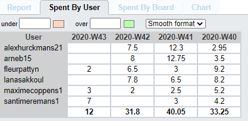

# Intervisiegesprek

|                     |                   |
|--------------------:|:------------------|
|            **Week** | 5                 |
|           **Datum** | 2020-10-19, 15:00 |
|        **Aanwezig** | Arne Bieseman, Maxime coppens, Alex Hurckmans, Santi Meremans, Pattyn Fleur en Lana Sakkoul|
| **Verontschuldigd** | / |
|         **Afwezig** | / |
|    **Verslaggever** |                   |

## Agenda

- Realisaties vorige periode
- Problemen
- Planning komende periode

## Realisaties vorige periode

### Algemeen

## Kanban-bord:

## Burndown-charts:

## Tijdsregistratie:

### Arne Bieseman

## Gerealiseerd:

  - Windows server GPO's aanmaken + toekennen aan de OU's
  - Windows server DFS startScript
  - Windows server groups users en computers aanmaken
  - Windows server netwerkconfiguratie

## Gepland:

  - Windows server: DFS verder uitwerken
  - Windows server: GPO's regels instellen via regex of andere?

### Maxime coppens

## Gerealiseerd:
  - Web-UI van GNS via VirtualBox opgestart

## Gepland:
  - Een eerste volledige werkende topologie gesimuleerd via GNS3

### Alex Hurckmans

## Gerealiseerd:

  - Windows server GPO's aanmaken + toekennen aan de OU's
  - Windows server DFS startScript
  - Windows server groups users en computers aanmaken
  - Windows server netwerkconfiguratie

## Gepland:

  - Windows server: DFS verder uitwerken
  - Windows server: GPO's regels instellen via regex of andere?

### Santi Meremans

## Gerealiseerd:

  - Rol van Bert aanpassen.
	- Virtual hosting klaarzetten voor gebruik.
	- SSH implementeren.
	- Troubleshooten.

## Gepland:

  - Troubleshooting tot de infrastructuur volledig werkt.
  - Kijken hoever we als team staan, indien nodig bijspringen.
  - Beslissing in teamverband maken voor cloud-hosting.

### Pattyn Fleur

## Gerealiseerd:
- Labo netwerken afgewerkt buiten vragen
- Begin netwerk + opzetten GNSU3

## Gepland:
- DHCP: adressen verdeling
- DHCP: basis
- Testing schrijven Labo Netwerken

### Lana Sakkoul

## Gerealiseerd:
 - CNAME, NS en MX records opgezet

## Gepland:
 - Troubleshooting
 - Testen
## Problemen

  - Windows server: DFS een paar errors bij het aanmaken, nog niet goed begrijpen wat de code betekend
  - Windows server: OU's regex/pol files vinden we niet terug in regedit.msc

## Planning komende periode
