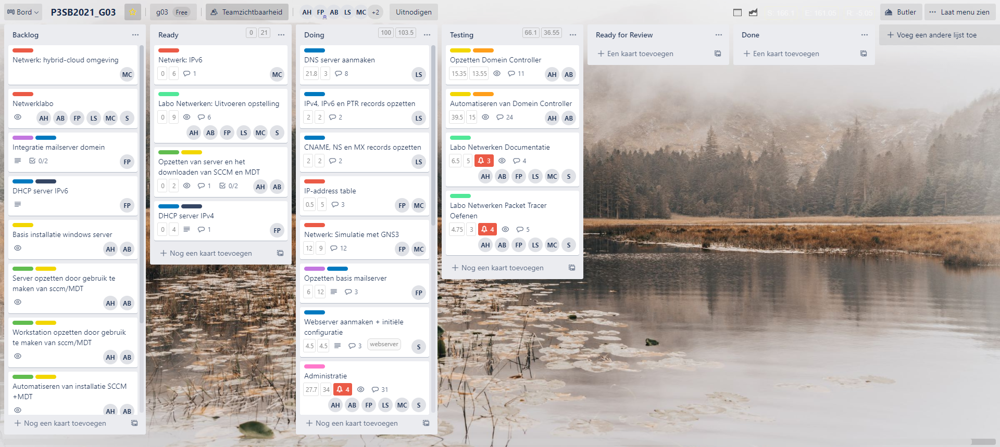
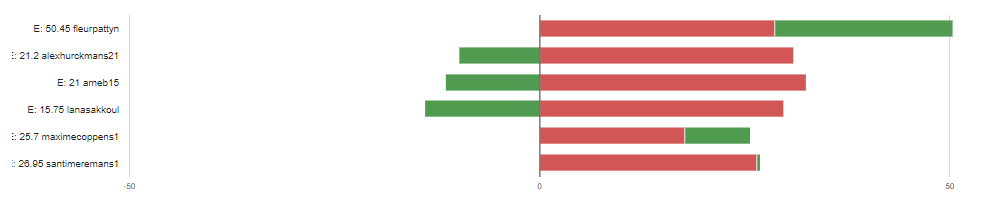
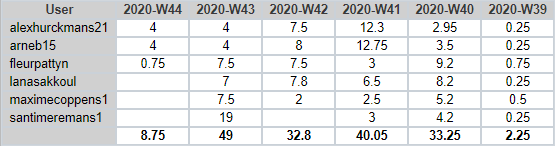

# Intervisiegesprek

|                     |                   |
|--------------------:|:------------------|
|            **Week** | 6                 |
|           **Datum** | 2020-MM-DD, HH:mm |
|        **Aanwezig** | Arne Bieseman, Maxime coppens, Alex Hurckmans, Santi Meremans, Pattyn Fleur en Lana Sakkoul|
| **Verontschuldigd** | / |
|         **Afwezig** | / |
|    **Verslaggever** |                   |

## Agenda

- Realisaties vorige periode
- Problemen
- Planning komende periode

## Realisaties vorige periode

### Algemeen

## Kanban-bord:

## Burndown-charts:

## Tijdsregistratie:

### Arne Bieseman

## Gerealiseerd:
- Windows init script aangepast(alle downloads daar geplaatst)
- Windows pol files aangemaakt en meenemen naar de server + pol script afgewerkt
- DFS maakt gedeelde mappen aan + persoonlijke map per user.

## Gepland:
- unscripted MDT en sccm server
  - toevoegen aan het domein
  - de MDT en sccm rollen downloaden
  - mdt opzetten zodat een server/workstation kan aangemaakt worden in samenwerking met sccm

### Maxime coppens

## Gerealiseerd:
  - GNS3 integratie met virtualbox
  - opzoeken hoe een img van cisco routers te integreren (vraag tijdens meeting)

## Gepland:
  - GNS3 configuratie met alle onderdelen (bijna volledig afwerken)
  - adressentabel afwerken en online zetten

### Alex Hurckmans

## Gerealiseerd:
- Windows init script aangepast(alle downloads daar geplaatst)
- Windows pol files aangemaakt en meenemen naar de server + pol script afgewerkt
- DFS maakt gedeelde mappen aan + persoonlijke map per user.

## Gepland:
- unscripted MDT en sccm server
  - toevoegen aan het domein
  - de MDT en sccm rollen downloaden
  - mdt opzetten zodat een server/workstation kan aangemaakt worden in samenwerking met sccm

### Santi Meremans

## Gerealiseerd:
SSL werkt op ip adress. Surfen naar https://192.168.56.10 geeft SSL verbinding. Met zelfgemaakte index pagina.

## Gepland:
Postgresql database met database voor wordpress. Wordpress als default pagina zetten. Installeren en unzippen in de juiste directory.
### Pattyn Fleur

## Gerealiseerd:
- DHCP basis (Nog geen IPv4 subnetting)

## Gepland:
- DHCP IPv4 subnetting
- DHCP IPv6
- Eventuele correcties op testen van Labo Netwerken

### Lana Sakkoul

## Gerealiseerd:
 - Error primaries set for each zone gefixed
## Gepland:
 - Troubleshoot dns server met  web server

## Problemen

## Planning komende periode
