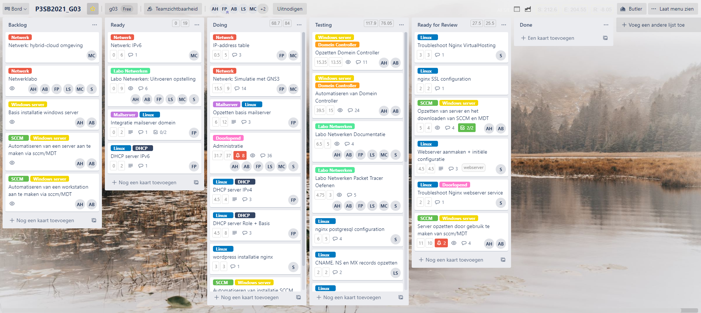
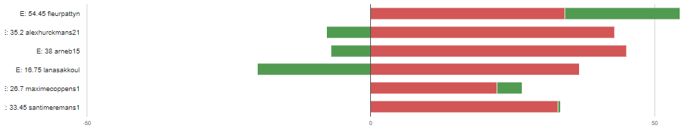
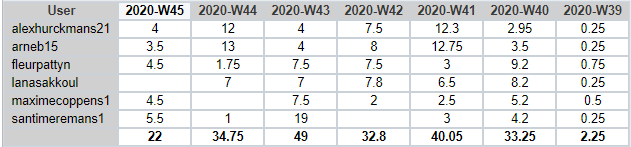

# Intervisiegesprek

|                     |                   |
|--------------------:|:------------------|
|            **Week** | 7                 |
|           **Datum** | 2020-MM-DD, HH:mm |
|        **Aanwezig** | Arne Bieseman, Maxime coppens, Alex Hurckmans, Santi Meremans, Pattyn Fleur en Lana Sakkoul|
| **Verontschuldigd** | / |
|         **Afwezig** | / |
|    **Verslaggever** |                   |

## Agenda

- Realisaties vorige periode
- Problemen
- Planning komende periode

## Realisaties vorige periode

### Algemeen

## Kanban-bord:

## Burndown-charts:

## Tijdsregistratie:

### Arne Bieseman

## Gerealiseerd:
- SCCM/MDT server unscripted opgezet:
  - Toegevoegd aan domein
  - MDT, ADK, ADKWINPE gedownload
  - WDS, WSUS gedownload en geconfigureerd
  - Server image aangemaakt
  - Workstation image aangemaakt
  - Images toegevoegd aan WDS
- SCCM/MDT server scripted opgezet:
  - Initiële settings aanpassen: toevoegen aan het domein, iso's verplaatsen
  - Downloaden van WSUS en WDS + WDS beantwoord alle client requests
  - Downloaden van MDT, ADK, ADKWINPE
  - Server image aanmaken (iso laden, files overschrijven, updaten deploymentshare)
  - Workstation image aanmaken (iso laden, files overschrijven, updaten deploymentshare)
  -Boot image toevoegen aan WDS

## Gepland:
- Testrapporten schrijven
- Documentatie schrijven
- Variabelen en init files gebruiken

### Maxime coppens

## Gerealiseerd:
- Images geïntegreerd => probleem bij het gebruiken in de applicatie
- Eerste configuraties voor netwerk simulatie
## Gepland:
- Simulatie met GNS3 werkend en afgewerkt

### Alex Hurckmans

## Gerealiseerd:
- SCCM/MDT server unscripted opgezet:
  - Toegevoegd aan domein
  - MDT, ADK, ADKWINPE gedownload
  - WDS, WSUS gedownload en geconfigureerd
  - Server image aangemaakt
  - Workstation image aangemaakt
  - Images toegevoegd aan WDS
- SCCM/MDT server scripted opgezet:
  - Initiële settings aanpassen: toevoegen aan het domein, iso's verplaatsen
  - Downloaden van WSUS en WDS + WDS beantwoord alle client requests
  - Downloaden van MDT, ADK, ADKWINPE
  - Server image aanmaken (iso laden, files overschrijven, updaten deploymentshare)
  - Workstation image aanmaken (iso laden, files overschrijven, updaten deploymentshare)
  -Boot image toevoegen aan WDS

## Gepland:
- Testrapporten schrijven
- Documentatie schrijven
- Variabelen en init files gebruiken

### Santi Meremans

## Gerealiseerd:

- postgresql installatie successvol met benodigde configuratie, aanmaak database wordpress.
- wordpress installatie voltooid, staat als index.php pagina klaar
Laatste probleem is de niet geweldig ondersteunde compatibiliteit tussen wordpress en postgresql. Dit is volgens mij de reden waarom mijn index pagina in plain text verschijnt. Mijn eerste blik hierop gaf aan dat het niet aangeraden wordt deze 2 te combineren. De prioriteit gaat nu naar de cloud-oplossing te vinden en de verschillende componenten te laten samenwerken. Indien er tijd is zal ik dit troubleshooten.

## Gepland:
  - afwerking installatie postgresql
  - afwerking installatie wordpress

### Pattyn Fleur

## Gerealiseerd:
- DHCP Ipv4 in orde gekregen (Lang gezocht bij subnetting waarom 255.255.255.192 niet werkt en niet gevonden. Overgeschakeld naar 255.255.255.128)

## Gepland:
- DHCP IPv6
- Netwerklabo verbeteren (zorgen dat het getest wordt)
- Cloud informatie + eventuele start

### Lana Sakkoul

## Gerealiseerd:
- DNS server in orde
## Gepland:
- Microsoft Azure

## Problemen

## Planning komende periode
