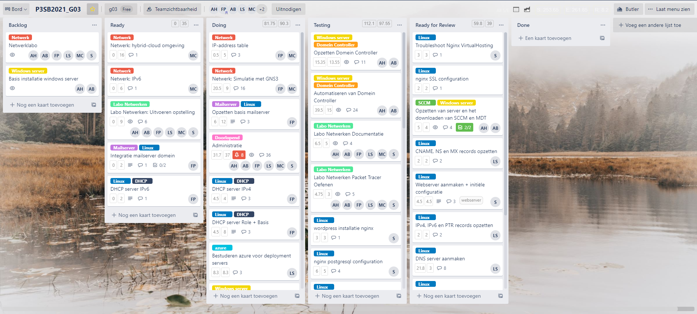
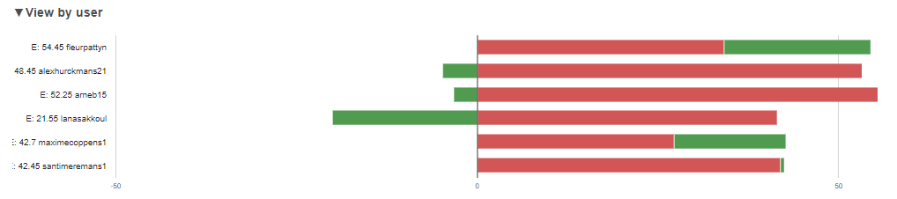
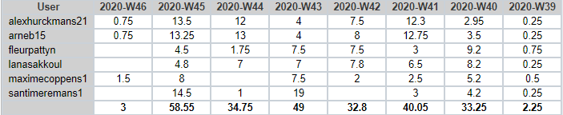

# Intervisiegesprek

|                     |                   |
|--------------------:|:------------------|
|            **Week** | 8                 |
|           **Datum** | 2020-11-09, 15:00 |
|        **Aanwezig** | Arne Bieseman, Maxime coppens, Alex Hurckmans, Santi Meremans, Pattyn Fleur en Lana Sakkoul|
| **Verontschuldigd** | / |
|         **Afwezig** | / |
|    **Verslaggever** |                   |

## Agenda

- Realisaties vorige periode
- Problemen
- Planning komende periode

## Realisaties vorige periode

### Algemeen

## Kanban-bord:

## Burndown-charts:

## Tijdsregistratie:

### Arne Bieseman

## Gerealiseerd:
- SCCM/MDT server unscripted opgezet:
  - Toegevoegd aan domein
  - MDT, ADK, ADKWINPE gedownload
  - WDS, WSUS gedownload en geconfigureerd
  - Server image aangemaakt
  - Workstation image aangemaakt
  - Images toegevoegd aan WDS
- SCCM/MDT server scripted opgezet:
  - Initiële settings aanpassen: toevoegen aan het domein, iso's verplaatsen
  - Downloaden van WSUS en WDS + WDS beantwoord alle client requests
  - Downloaden van MDT, ADK, ADKWINPE
  - Server image aanmaken (iso laden, files overschrijven, updaten deploymentshare)
  - Workstation image aanmaken (iso laden, files overschrijven, updaten deploymentshare)
  -Boot image toevoegen aan WDS

## Gepland:
- Testrapporten schrijven
- Documentatie schrijven
- Variabelen en init files gebruiken

### Maxime coppens

## Gerealiseerd:
- GNS3 simulatie bijna afgewerkt (probleem bij img van L3 switch = vraag gesteld op teams)
- Testing van labo begonnen

## Gepland:
- GNS3 simulatie afgewerkt en ready for review 
- Test van labo en testrapport afwerken en aanvullen
- Testplan aanmaken voor GNS3
- Opzoeken hoe Azure gebruiken met GNS3

### Alex Hurckmans

## Gerealiseerd:
- SCCM/MDT server unscripted opgezet:
  - Toegevoegd aan domein
  - MDT, ADK, ADKWINPE gedownload
  - WDS, WSUS gedownload en geconfigureerd
  - Server image aangemaakt
  - Workstation image aangemaakt
  - Images toegevoegd aan WDS
- SCCM/MDT server scripted opgezet:
  - Initiële settings aanpassen: toevoegen aan het domein, iso's verplaatsen
  - Downloaden van WSUS en WDS + WDS beantwoord alle client requests
  - Downloaden van MDT, ADK, ADKWINPE
  - Server image aanmaken (iso laden, files overschrijven, updaten deploymentshare)
  - Workstation image aanmaken (iso laden, files overschrijven, updaten deploymentshare)
  -Boot image toevoegen aan WDS

## Gepland:
- Testrapporten schrijven
- Documentatie schrijven
- Variabelen en init files gebruiken

### Santi Meremans

## Gerealiseerd:
Een vagrant machine laten draaien in azure met azure cli, azure plugin. Inline provisioning werd gerealiseerd net zoals bash provisioning. Ansible-provisioning bottleneck was dat ansible niet op de host machine van mijn windows was geïnstalleerd. Gefaald om deze te installeren met wyget.
## Gepland:
Vragen stellen over deze bottleneck. Kijken of mijn methodiek tot nu goed is. Overleggen met team wie zich zal bezighouden met de windowsmachines op azure te krijgen.
### Pattyn Fleur

## Gerealiseerd:
- DHCP ipv4 ok, ipv6 ok
- Cloud combinatie azure en ansible geinformeerd
- Test netwerk labo aangevuld wegens onduidelijkheid

## Gepland:
- Testen DNS
- Mail Test schrijven in combinatie met domein
- Informeren waar helpen bij Cloud

### Lana Sakkoul

## Gerealiseerd:
- Vagrant machine laten draaien in azure met azure cli, azure plugin.
## Gepland:
- Verder werken aan Azure

## Problemen

## Planning komende periode
