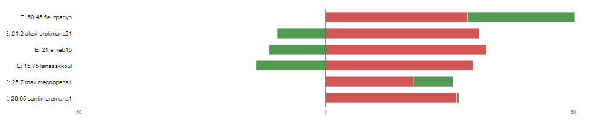

# Intervisiegesprek

|                     |                   |
|--------------------:|:------------------|
|            **Week** | 9                 |
|           **Datum** | 2020-11-16, 15:00 |
|        **Aanwezig** | Arne Bieseman, Maxime coppens, Alex Hurckmans, Santi Meremans, Pattyn Fleur en Lana Sakkoul|
| **Verontschuldigd** | / |
|         **Afwezig** | / |
|    **Verslaggever** |                   |

## Agenda

- Realisaties vorige periode
- Problemen
- Planning komende periode

## Realisaties vorige periode

### Algemeen

## Kanban-bord:

## Burndown-charts:

## Tijdsregistratie:

### Arne Bieseman

## Gerealiseerd:
- Server echo verder uitgewerkt: Control folder voor workstation enserver overnemen, script getest.
- IPv6 addressen toegekend + DNS-sen
- markdown documentatie geschreven voor de tester

## Gepland:
- Afwerken van de beide servers (details)
- De cloud oplossing bekijken en toepassen

### Maxime coppens

## Gerealiseerd:
- Testing van Labo simulatie met packettracer afgewerkt: documentatie testrapport en pkt bestand volledig afgewerkt en geconfigureerd
- Troubleshooting + GNS3 bijna volledig af (simulatie zonder cloud) en begin testplan maken

## Gepland:
- GNS3 met cloud begin configuratie en extra opzoekwerk
- Alle documentatie afwerken omtrent GNS3 (testplan, research, tutorial) en op github zetten (in de loop van volgende weken)

### Alex Hurckmans

## Gerealiseerd:
- Server echo verder uitgewerkt: Control folder voor workstation enserver overnemen, script getest.
- IPv6 addressen toegekend + DNS-sen
- markdown documentatie geschreven voor de tester
- testrapport aangemaakt en fouten opgelost (spellingsfouten, verkeerde pad)

## Gepland:
- Afwerken van de beide servers (details)
- De cloud oplossing bekijken en toepassen
- Testapport voor echo uitschrijven

### Santi Meremans

## Gerealiseerd:
Machine op azure laten draaien en provisionen met Ansible. Het ansible playbook kon nog niet volledig voltooiien omdat er nog aanpassingen nodig zijn aan de structuur van het playbook. Gewerkt met azure continuous integration pipelines.

Laatste compatibiliteitstroubleshoot tussen postgresql en wordpress. Van andere groepen gehoord dat dit bij hun ook een probleem is dat niet snel opgelost geraakt. De database connection kan nog niet geïnitialiseerd worden.

## Gepland:

### Pattyn Fleur

## Gerealiseerd:
- DC getest
- Probeerselen om ipv6 in te schakelen zodat provision ook werkt. (niet gelukt via config file, momenteel kijken via module)

## Gepland:
- Dhcp afwerken + testen schrijven
- Testen Webserver + DNS
- Test schrijven mailserver

### Lana Sakkoul

## Gerealiseerd:
- Testplan DNS server maken.
- Machine op azure laten draaien en provisionen met Ansible.
## Gepland:
- Verder werken aan Azure

## Problemen

## Planning komende periode
